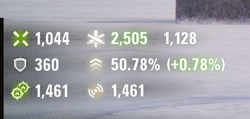
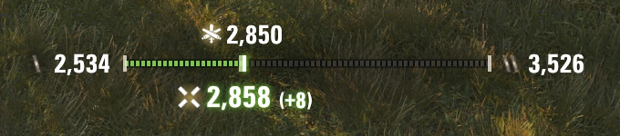
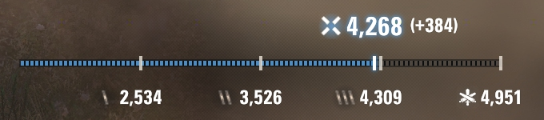

# 14th_ua's MoE Calculator — World of Tanks mod

Track your **Marks of Excellence (MoE)** progress for the vehicle you have selected,
in the Garage and live in battle. The mod reads the game's own MoE data and renders it
with the client's own mark art and interface styling, so it looks like a built-in part
of the interface rather than an add-on.

**English** · [Українська](#14th_uas-moe-calculator--українська)

|  |  |
|:--:|:--:|
|  |  |
| In-battle overlay | Garage MoE bar |
|  |  |
| Progress bar — Moving Average | Progress bar — Damage Efficiency |

## What it shows

### Garage MoE bar

A percentile bar in the vehicle-parameters panel with milestone ticks at **65% / 85% /
95%** — the 1 / 2 / 3-mark thresholds — each drawn with the client's own mark art. Every
tick is labelled with the combined damage that mark requires, and the bar fills to your
current standing. Above it, a readout shows your current average combined damage and your
current mark percentage for the selected vehicle.

**Ctrl+drag** the widget to move it anywhere on screen (hold **Shift** to lock the drag to
one axis). Where you drop it is remembered; the panel also has numeric position fields and a
**Follow Carousel Mode** option — see Settings.

### In-battle overlay

A compact overlay over the HUD with two lines (an optional third row shows counted
assistance — see Settings):

- **Live combined damage vs your projected average** — the number is coloured by sign
  (red below your projection, white at it, green above).
- **Your projected MoE percentage** with the signed change versus where you started the
  battle.

### In-battle progress bar *(off by default)*

A wide bar in the **centre of the screen**, separate from the corner overlay. By default it
fades in when there is something new to show, holds for a few seconds (five by default,
adjustable in Settings), then fades out on its own, and **holding Alt** also brings it up —
independent of the overlay's own Alt-press setting; settings below let you turn either trigger
off, or pin the bar up permanently. The bar never takes mouse input, and it stays hidden while
the **Tab** scoreboard is open, while you are spectating, and before you have a vehicle.
Settings let you draw it **Large** and switch the fades off so it appears and disappears
instantly. **Ctrl+drag** the bar to reposition it anywhere on screen — the position is shared
by both variants and remembered; the panel also has numeric X/Y fields for it — see Settings.

Turn it on in Settings and pick **one** of two bars — they are mutually exclusive:

- **Damage Efficiency** *(default)* — this battle's combined damage against all four
  requirements (**65% / 85% / 95% / 100%**) laid out on four equal quarters, with every
  requirement you have already passed lit up. No baseline needed, and it comes up on its own
  each time your damage this battle reaches a new high.
- **Moving Average** — where your career projected average combined damage sits between the
  mark you already hold and the next mark's requirement, with this battle's signed contribution
  beside it. The next-mark caption also carries an **ETA**: how many more battles you need at
  your current pace to reach it. It comes up whenever that projection moves. It needs a career
  baseline, so it shows nothing in replays, or after a relogin until you have visited the Garage.

Three switches decide **when** it comes up: **Events** (a tracked battle event raises it, on by
default), **Alt Press** (holding Alt shows it, on by default) and **Always** (pins it on screen
permanently and greys out the other two, off by default). A separate **Transitions** switch
decides **how** it moves once it does — fading and sliding by default, or instant if you turn
it off — and how long it holds before fading away.

The corner overlay's position is fixed; the centre-screen bar's position is not — see *Bar
Position* under Settings. On a vehicle whose mark thresholds could not be fetched, neither bar
draws — the Garage bar still does.

## Compatibility

| Requirement | Detail |
|-------------|--------|
| **Game** | World of Tanks **EU 2.3.1.0** (Wargaming global client). Built and tested against this version. |
| **Required** | **OpenWG GameFace** 1.1.6+ — install it first, or the widget will not appear. From [wgmods.net](https://wgmods.net) or [gitlab.com/openwg/wot.gameface](https://gitlab.com/openwg/wot.gameface). |

## Download & install

**Easiest — the one-click installer (Windows).** Download the latest
**`MoECalculator-Setup-<version>.exe`** from the
[**GitHub Releases**](https://github.com/drizzer14/moe-calculator/releases) page and run
it (close the game first). It finds your World of Tanks folder, installs the mod into
`mods\<version>\`, and adds its bundled dependencies — **OpenWG GameFace**,
**ModsSettingsAPI**, and **ModsList** — for any you don't already have. On each
run it also checks GitHub and offers to fetch the newest
installer, so a copy you keep around stays current.

**Manual installation.** Grab `com.14th_ua.moe_calculator_<version>.wotmod` from the same
Releases page and follow **[`INSTALL.md`](./INSTALL.md)** — it covers the manual copy,
verifying it works, troubleshooting, and uninstalling.

## Settings

The mod adds a settings panel to the in-game **mod-settings menu**, provided by
**ModsSettingsAPI (MSA)** — the standard settings host bundled with the installer. If MSA
isn't loaded, the mod still runs with both widgets on by default; you just won't see the panel.

The panel is grouped into named **categories**, each a bold header row followed by that
feature's controls — so a feature's own on/off switch is simply labelled **Enabled**. Column 1
holds the two in-battle features, column 2 the Garage one:

| Setting | Default | What it does |
|---|---|---|
| *Battle Calculator* | — | Category header for the in-battle overlay. |
| **Enabled** | On | Shows the live MoE overlay during battle. |
| ↳ **Alt Press** | Off | Shows the overlay only while **Alt** is held; when off it is visible at all times. |
| ↳ **Counted Assistance Row** | On | Adds a third overlay row: the higher of tracking, spotting or stun assist, with an icon for whichever leads. |
| *Battle Progress* | — | Category header for the centre-screen progress bar. |
| **Enabled** | Off | Shows the centre-screen bar. Pick the mode and size below, and when it comes up with the three switches beneath. |
| ↳ **Events** | On | Raises the bar on its own whenever a tracked battle event happens, then fades it away again. Ignored while **Always** is on. |
| ↳ **Alt Press** | On | Shows the bar only while **Alt** is held. Ignored while **Always** is on. |
| ↳ **Always** | Off | Keeps the bar on screen permanently; it never fades. Overrides both switches above, which grey out while this is on. |
| **Mode** | Damage Efficiency | The two mutually exclusive bars, **Damage Efficiency** *(default)* and **Moving Average** — an inline, unlabelled pair of radio buttons. |
| **Scale** | Default | **Default** or **Large**. Large draws a noticeably bigger bar — same layout, just larger. |
| *Transitions* | — | Category header for how the centre-screen bar animates and how long it stays up. |
| **Enabled** | On | The bar fades and slides as it appears and disappears. Turn off to make it appear and disappear **instantly** instead; the bar still shows and still hides, only the motion is skipped. |
| ↳ **Events** | On | Animates the bar when a battle event brings it up (a damage tick) and lets it go again. |
| ↳ **Alt Press** | On | Animates the **Alt** peek. Off matches the game's own interface, which does not animate on Alt. |
| ↳ **Hold Duration (s)** | 5 | How many seconds the bar stays up before it starts fading away (or disappearing, if Transitions is off). Range 1–30. |
| *Bar Position* | — | Category header for the centre-screen progress bar's position. |
| **Horizontal (left X)** / **Vertical (top Y)** | 0 = auto | The centre-screen bar's distance from the left / top screen edge, in pixels — shared by both bar modes. **Ctrl+drag** the bar to set it. |
| *Garage Widget* | — | Category header for the Garage bar. |
| **Enabled** | On | Shows the MoE percentile bar in the Garage, on the selected vehicle. |
| *Layout* | — | Sub-category for the Garage widget's position. |
| **Follow Carousel Mode** | On | A pinned widget keeps shifting vertically with the vehicle carousel (single / double rows) so it never overlaps it. |
| **Horizontal (left X)** / **Vertical (top Y)** | 0 = auto | The pinned widget's distance from the left / top screen edge, in pixels. **Ctrl+drag** the widget to pin it (hold **Shift** to lock to one axis). |

Unchecking a master checkbox (**Battle Calculator**'s, **Battle Progress**'s, and
**Transitions**'s own **Enabled**) greys its indented children out; the Garage settings and
**Bar Position** have no such master. **Always**, in turn, greys out **Events** and **Alt Press**
right above it once it's on. **Mode**, **Scale**, **Bar Position** and the **Layout** controls
all sit alongside their category's master rather than under it, so they stay clickable while the
feature itself is off — they simply have nothing to affect until you switch it on. **0 / 0** is
the default bottom-right position for the Garage widget, and also the default (auto) position for
the centre-screen progress bar — both restored by the panel's per-mod **Reset**. The Garage
position settings apply to the Garage widget only; **Bar Position** applies to the centre-screen
progress bar (shared by both modes) — the corner overlay's position is fixed. What each
progress-bar mode shows, and the career baseline **Moving Average** needs, is described under
*In-battle progress bar* above.

## Notes

- **After a game update**, move the `.wotmod` to the new `mods\<version>\` folder. A new
  client version may need a rebuilt mod — check the Releases page.

## MoE data source

The per-tank mark thresholds (the combined damage each mark needs) come from the **official
Wargaming API** — the real damage distribution, so the numbers are authoritative and current.
Thresholds are cached locally so switching vehicles is instant. The in-battle percentage between
marks is interpolated the same way Wargaming's own Marks of Excellence percentage is, for the
closest possible match to what the game itself would show you.

## Modpacks & license

Free to use, redistribute, and include in modpacks as long as it stays free and credits the
author (**14th_ua**) with a link back to this repository — see [`LICENSE.md`](./LICENSE.md).
For modpacks, add only the `.wotmod` and list OpenWG GameFace as a required dependency; don't
bundle GameFace yourself.

## Contributing / developers

Building, deploying, testing, and the repo layout are documented in
[`CLAUDE.md`](./CLAUDE.md) (and the dev loop in [`tools/dev/README.md`](./tools/dev/README.md)).

---

# 14th_ua's MoE Calculator — Українська

Відстежуйте прогрес **Знаків Класності** (Marks of Excellence) для обраної техніки — в
Ангарі та наживо в бою. Мод читає власні дані гри про класність і малює їх рідними іконками
та стилем інтерфейсу клієнта, тож він виглядає як вбудована частина інтерфейсу, а не
стороннє доповнення.

[English](#14th_uas-moe-calculator--world-of-tanks-mod) · **Українська**

|  |  |
|:--:|:--:|
|  |  |
| Смуга класності в Ангарі | Оверлей у бою |
|  |  |
| Смуга прогресу — Ковзне середнє | Смуга прогресу — Ефективність шкоди |

## Що показує

### Смуга класності в Ангарі

Смуга за перцентилем у панелі параметрів техніки з позначками на **65% / 85% / 95%** —
пороги 1 / 2 / 3 знаків — кожна намальована рідною іконкою знака з клієнта. Кожна позначка
підписана комбінованою шкодою, потрібною для цього знака, а смуга заповнюється до вашого
поточного стану. Над нею — ваша поточна середня комбінована шкода й поточний відсоток знака
для обраної техніки.

**Ctrl+перетягування** переміщує віджет у будь-яке місце екрана (утримуйте **Shift**, щоб
зафіксувати перетягування за однією віссю). Місце, де ви його відпустили, запам'ятовується; у
панелі також є числові поля позиції та параметр **Слідувати за каруселлю** — див. Налаштування.

### Оверлей у бою

Компактний оверлей над HUD із двома рядками (необов'язковий третій рядок показує зараховану
допомогу — див. Налаштування):

- **Поточна комбінована шкода проти прогнозованого середнього** — число забарвлене за знаком
  (червоне нижче прогнозу, біле на рівні, зелене вище).
- **Прогнозований відсоток знака** зі знаком зміни відносно початку бою.

### Смуга прогресу в бою *(вимкнено за замовчуванням)*

Широка смуга в **центрі екрана**, окрема від кутового оверлея. За замовчуванням вона з'являється,
коли є що показати, тримається кілька секунд (п'ять за замовчуванням, налаштовується в
Налаштуваннях) і зникає сама, а **утримання Alt** також показує її — незалежно від власного
параметра оверлея з натисканням Alt; налаштування нижче дозволяють вимкнути будь-який із цих
тригерів або закріпити смугу на екрані назавжди. Смуга ніколи не перехоплює керування мишею й
залишається схованою, поки відкрита таблиця результатів (**Tab**), під час спостереження за іншим
гравцем і доки у вас немає техніки. Налаштування дозволяють намалювати її **Великою** та вимкнути
плавні переходи, щоб вона з'являлася й зникала миттєво. **Ctrl+перетягування** переміщує смугу в
будь-яке місце екрана — позиція спільна для обох режимів і запам'ятовується; у панелі також є
числові поля X/Y для неї — див. Налаштування.

Увімкніть її в Налаштуваннях і виберіть **одну** з двох смуг — вони взаємовиключні:

- **Ефективність шкоди** *(за замовчуванням)* — шкода цього бою відносно всіх чотирьох вимог
  (**65% / 85% / 95% / 100%**), розкладених на чотири рівні чверті, з підсвіченими вимогами, які
  ви вже пройшли. Не потребує базового значення й з'являється сама щоразу, коли ваша шкода в
  цьому бою досягає нового максимуму.
- **Ковзне середнє** — де перебуває ваша прогнозована середня комбінована шкода за кар'єру між
  наявною позначкою та вимогою наступної, з підписаним внеском цього бою поруч. Підпис наступної
  позначки також показує **прогноз**: скільки ще боїв потрібно у вашому поточному темпі, щоб її
  досягти. З'являється щоразу, коли цей прогноз змінюється. Потребує базового значення кар'єри,
  тож у реплеях, а також після повторного входу, доки ви не зайшли в Ангар, вона нічого не показує.

Три перемикачі вирішують, **коли** вона з'являється: **Події** (відстежувана подія в бою показує
її, увімкнено за замовчуванням), **Натискання Alt** (утримання Alt показує її, увімкнено за
замовчуванням) і **Завжди** (закріплює її на екрані назавжди й робить два інші перемикачі
неактивними, вимкнено за замовчуванням). Окремий перемикач **Переходи** вирішує, **як** вона
рухається, коли з'являється, — з плавним затуханням і зсувом за замовчуванням, або миттєво, якщо
його вимкнути, — а також як довго вона тримається, перш ніж почати зникати.

Позиція кутового оверлея незмінна; позиція смуги в центрі екрана — **налаштовується**, див.
розділ *Позиція смуги* в Налаштуваннях. На техніці, для якої не вдалося отримати пороги знаків,
жодна зі смуг не малюється — смуга в Ангарі все одно працює.

## Сумісність

| Вимога | Деталі |
|--------|--------|
| **Гра** | World of Tanks **EU 2.3.1.0** (глобальний клієнт Wargaming). Зібрано й перевірено для цієї версії. |
| **Обов'язково** | **OpenWG GameFace** 1.1.6+ — встановіть першим, інакше віджет не з'явиться. З [wgmods.net](https://wgmods.net) або [gitlab.com/openwg/wot.gameface](https://gitlab.com/openwg/wot.gameface). |

## Завантаження та встановлення

**Найпростіше — інсталятор в один клік (Windows).** Завантажте найновіший
**`MoECalculator-Setup-<version>.exe`** зі сторінки
[**релізів на GitHub**](https://github.com/drizzer14/moe-calculator/releases) і запустіть
(спершу закрийте гру). Він знаходить папку World of Tanks, встановлює мод у `mods\<version>\`
і додає вкладені залежності — **OpenWG GameFace**, **ModsSettingsAPI** та **ModsList** — для
тих, яких ще немає. Під час кожного запуску
він також перевіряє GitHub і пропонує завантажити найновіший інсталятор, тож збережена копія
залишається актуальною.

**Встановлення вручну.** Візьміть `com.14th_ua.moe_calculator_<version>.wotmod` з тієї ж
сторінки релізів і дотримуйтесь **[`INSTALL.md`](./INSTALL.md)** — там описано ручне
копіювання, перевірку роботи, усунення несправностей і видалення.

## Налаштування

Мод додає панель до внутрішньоігрового **меню налаштувань модів**, яке надає
**ModsSettingsAPI (MSA)** — стандартний застосунок налаштувань, що йде разом з інсталятором.
Якщо MSA не завантажено, мод усе одно працює з увімкненими за замовчуванням віджетами — просто
не буде панелі.

Панель згрупована в іменовані **категорії**, кожна — жирний заголовок, за яким ідуть параметри цієї
функції, тож власний перемикач кожної функції називається просто **Увімкнено**. Стовпець 1 містить
дві бойові функції, стовпець 2 — Ангар:

| Налаштування | За замовчуванням | Що робить |
|---|---|---|
| *Бойовий калькулятор* | — | Заголовок категорії для оверлею в бою. |
| **Увімкнено** | Увімк. | Показує накладання класності наживо під час бою. |
| ↳ **Натискання Alt** | Вимк. | Показує накладання лише поки утримується **Alt**; коли вимкнено — показує постійно. |
| ↳ **Рядок зарахованої допомоги** | Увімк. | Додає третій рядок накладання: більше з допомоги гусеницями, засвітом чи оглушенням, з піктограмою переважного типу. |
| *Прогрес у бою* | — | Заголовок категорії для смуги прогресу в центрі екрана. |
| **Увімкнено** | Вимк. | Показує смугу в центрі екрана. Режим і масштаб виберіть нижче, а коли вона з'являється — трьома перемикачами під ними. |
| ↳ **Події** | Увімк. | Самостійно показує смугу, щойно відбувається відстежувана подія в бою, і знову ховає її. Ігнорується, поки увімкнено **Завжди**. |
| ↳ **Натискання Alt** | Увімк. | Показує смугу, лише поки утримується **Alt**. Ігнорується, поки увімкнено **Завжди**. |
| ↳ **Завжди** | Вимк. | Залишає смугу на екрані назавжди; вона ніколи не зникає. Має пріоритет над обома перемикачами вище, які стають неактивними, поки цей увімкнено. |
| **Режим** | Ефективність шкоди | Вибір між двома взаємовиключними режимами — **Ефективність шкоди** *(за замовчуванням)* та **Ковзне середнє** — пара радіокнопок в один рядок без підпису. |
| **Масштаб** | Стандартний | **Стандартний** або **Великий**. Великий малює помітно більшу смугу — той самий вигляд, просто більша. |
| *Переходи* | — | Заголовок категорії для того, як анімується смуга в центрі екрана і як довго вона тримається на екрані. |
| **Увімкнено** | Увімк. | Смуга з'являється та зникає з плавним затуханням і зсувом. Вимкніть, щоб вона з'являлася й зникала **миттєво**; смуга все одно показується й ховається, лише без анімації. |
| ↳ **Події** | Увімк. | Анімує смугу, коли її показує подія в бою (тик шкоди), і коли вона знову ховається. |
| ↳ **Натискання Alt** | Увімк. | Анімує показ по **Alt**. Вимкнено — як у власному інтерфейсі гри, який не анімує по Alt. |
| ↳ **Тривалість показу (с)** | 5 | Скільки секунд смуга тримається на екрані, перш ніж почати зникати (або зникнути одразу, якщо Переходи вимкнено). Діапазон 1–30. |
| *Позиція смуги* | — | Заголовок категорії для позиції смуги прогресу в центрі екрана. |
| **Горизонталь (лівий X)** / **Вертикаль (верхній Y)** | 0 = авто | Відстань смуги в центрі екрана від лівого / верхнього краю екрана в пікселях — спільна для обох режимів смуги. **Ctrl+перетягування** смуги встановлює її. |
| *Віджет в ангарі* | — | Заголовок категорії для смуги в Ангарі. |
| **Увімкнено** | Увімк. | Показує смугу процентиля класності в Ангарі на вибраній машині. |
| *Розташування* | — | Підкатегорія для позиції віджета в Ангарі. |
| **Слідувати за каруселлю** | Увімк. | Закріплений віджет продовжує зміщуватися по вертикалі разом із каруселлю техніки (один / два ряди), щоб ніколи її не перекривати. |
| **Горизонталь (лівий X)** / **Вертикаль (верхній Y)** | 0 = авто | Відстань закріпленого віджета від лівого / верхнього краю екрана в пікселях. **Ctrl+перетягування** закріплює віджет (**Shift** фіксує за однією віссю). |

Зняття позначки з головного перемикача (власне **Увімкнено** у **Бойовому калькуляторі**, у
**Прогресі в бою** й у **Переходах**) робить його вкладені рядки неактивними; параметри Ангара та
**Позиція смуги** головного не мають. **Завжди**, своєю чергою, робить неактивними **Події** та
**Натискання Alt** одразу над ним, щойно він увімкнений. **Режим**, **Масштаб**, **Позиція смуги**
та параметри **Розташування** розташовані поряд із головним перемикачем своєї категорії, а не під
ним, тож лишаються активними, навіть коли сама функція вимкнена, — просто їм нічого впливати, доки
її не увімкнено. **0 / 0** — стандартна позиція в правому нижньому куті для віджета в Ангарі, а для
смуги прогресу в центрі екрана — стандартна (авто) позиція; обидві повертає кнопка **скидання**
мода в панелі. Параметри позиції Ангара стосуються лише його віджета; **Позиція смуги** стосується
смуги прогресу в центрі екрана (спільна для обох режимів) — позиція кутового оверлея незмінна. Що
показує кожен режим смуги прогресу і яке базове значення кар'єри потрібне для **Ковзного
середнього** — описано вище в розділі *Смуга прогресу в бою*.

## Примітки

- **Після оновлення гри** перемістіть `.wotmod` у нову папку `mods\<версія>\`. Нова версія
  клієнта може потребувати перезібраного мода — перевіряйте сторінку релізів.

## Джерело даних класності

Пороги знаків для кожної техніки (комбінована шкода, потрібна для знака) беруться з
**офіційного API Wargaming** — це реальний розподіл шкоди, тож числа автентичні й актуальні.
Пороги кешуються локально, тож перемикання техніки миттєве. Відсоток між знаками в бою
інтерполюється так само, як і власний відсоток класності Wargaming, — щоб якнайточніше
збігатися з тим, що показала б сама гра.

## Модпаки та ліцензія

Вільно використовувати, поширювати та включати в модпаки, доки це залишається безкоштовним і
зазначає автора (**14th_ua**) з посиланням на цей репозиторій — див. [`LICENSE.md`](./LICENSE.md).
Для модпаків додавайте лише `.wotmod` і вкажіть OpenWG GameFace як обов'язкову залежність; не
вкладайте GameFace самі.

## Розробка

Збірка, розгортання, тести та структура репозиторію описані в [`CLAUDE.md`](./CLAUDE.md) (а
цикл розробки — у [`tools/dev/README.md`](./tools/dev/README.md)).
